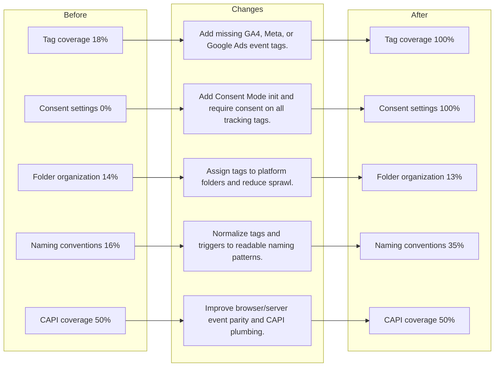
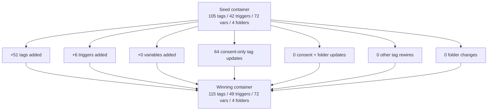

# BLADE Data Audit — Before vs After

**Date:** 2026-04-29
**Template:** content/gtm-templates/BLADE/seed/blade-web.json
**Ads Data:** enriched
**Meta Account:** act_1385707951714513
**Meta Pixel:** 311227299268737
**Google Ads Customer:** 174-183-3734
**Audit Source:** Automated post-win GTM audit

---

## Executive Summary

**Before:** 53.6%
**After:** 77.3%
**Improvement:** +23.7pp

**Loop Outcomes**
- Improved rounds: 6
- Reverted rounds: 24
- Validation failures: 0
- JSON failures: 0

**Bottom Line**
The winning container improved structural and ads-aligned tracking quality from 53.6% to 77.3%. The main gains came from consent remediation, missing event coverage, and selective trigger additions, while the remaining risk is concentrated in lower-scoring structural debt dimensions after the loop.

## Before vs After Scorecard

| Dimension | Before | After | Delta |
|-----------|--------|-------|-------|
| Tag coverage | 18% | 100% | 81.8pp |
| Parameter completeness | 84% | 88% | 3.7pp |
| Deduplication | 50% | 50% | 0.0pp |
| Consent settings | 0% | 100% | 100.0pp |
| Naming conventions | 16% | 35% | 18.9pp |
| Variable hygiene | 98% | 98% | 0.0pp |
| Trigger quality | 88% | 85% | -2.9pp |
| Folder organization | 14% | 13% | -1.3pp |
| Meta Ads alignment | 100% | 100% | 0.0pp |
| CAPI coverage | 50% | 50% | 0.0pp |
| Funnel integrity | 50% | 50% | 0.0pp |
| Google Ads alignment | 100% | 100% | 0.0pp |

## Opportunities Identified

1. **Tag coverage**: 18% → 100%. Missing GA4 event tag for "view_item" Suggested action: Add missing GA4, Meta, or Google Ads event tags.
2. **Consent settings**: 0% → 100%. Missing Consent Mode v2 initialization tag Suggested action: Add Consent Mode init and require consent on all tracking tags.
3. **Folder organization**: 14% → 13%. Tag not assigned to any folder Suggested action: Assign tags to platform folders and reduce sprawl.
4. **Naming conventions**: 16% → 35%. Tag name does not follow "Platform - Event" pattern Suggested action: Normalize tags and triggers to readable naming patterns.
5. **CAPI coverage**: 50% → 50%. All Meta events have zero counts — cannot compute CAPI coverage Suggested action: Improve browser/server event parity and CAPI plumbing.

## Mermaid — Opportunities Before to After

## Changes Made

### GTM Entity Delta

- Tags: 105 → 115 (51 added, 64 changed, 41 removed)
- Triggers: 42 → 49 (6 added, 0 changed, 0 removed)
- Variables: 72 → 72 (0 added, 0 changed, 0 removed)
- Folders: 4 → 4 (0 added, 0 changed, 0 removed)

### Change Summary

- Consent-only tag updates: 64
- Folder-only tag updates: 0
- Consent + folder tag updates: 0
- Other rewired tags: 0

### Added Tags

- AdTheorent - Purchase
- AdTheorent - Purchase New
- AdTheorent - Site Visit
- Bing - Add to Cart
- Bing - All Pages
- Bing - Purchase New
- Bing - Purchase Repeat
- BlackCrow - All Pages
- Consent - Mode v2 Init
- DoubleClick - All Pages
- DoubleClick - Purchase
- DoubleClick - Purchase New
- DoubleClick - Purchase New Airport
- DoubleClick - Purchase New Hamptons
- DoubleClick - Purchase New MSKY
- DoubleClick - Purchase New Nantucket
- DoubleClick - Purchase Repeat
- DoubleClick - Purchase Repeat Airport
- DoubleClick - Purchase Repeat Hamptons
- DoubleClick - Purchase Repeat MSKY

### Added Triggers

- CE - GA4 Ecom Events
- CE - add_payment_info
- CE - view_cart
- CE - view_item
- CE - view_item_list
- Consent Initialization - All Pages

### Other Rewired Tags

None

## Mermaid — Change Flow

## Critical Findings

### Strengths
- Tag coverage was materially improved during the run.
- No GTM entities were removed from the seed container.
- The winning JSON exists as a standalone pre-upload artifact with a matching experiment log.

### Remaining Risks
- Errors remaining: 1
- Warnings remaining: 248
- Lowest remaining dimensions:
- Folder organization (13%): Assign tags to platform folders and reduce sprawl.
- Naming conventions (35%): Normalize tags and triggers to readable naming patterns.
- Deduplication (50%): Wire a stable event_id into Meta browser and server events.
- CAPI coverage (50%): Improve browser/server event parity and CAPI plumbing.
- Funnel integrity (50%): Fix missing or misfiring funnel steps before conversion.

## Action Plan

### Phase 1: Pre-Upload Validation
- Compare seed vs winning JSON at the raw export level.
- Run the `data-audit` skill against the linked Meta account and pixel.
- Import only into staging and verify browser/server event behavior.

### Phase 2: Structural Debt Cleanup
- Address the still-low naming and folder organization dimensions.
- Review deduplication and CAPI coverage for browser/server parity.
- Re-run the loop after any large manual tidy pass.

### Phase 3: Ads-Side Verification
- Validate that the GTM changes actually map to better event capture in Meta and Google Ads.
- Confirm funnel step ratios after deployment.
- Use the post-deployment audit as the next baseline for another optimization pass.

## Files

- Winning config: `content/gtm-templates/BLADE/winning/2026-04-29T143650-blade-web.json`
- Experiment log: `content/gtm-templates/BLADE/loop-results/2026-04-29T143650.json`
- Run notes: `content/gtm-templates/BLADE/loop-results/notes/2026-04-29T143650.md`
- This audit: `content/gtm-templates/BLADE/loop-results/data-audits/2026-04-29T143650.md`
